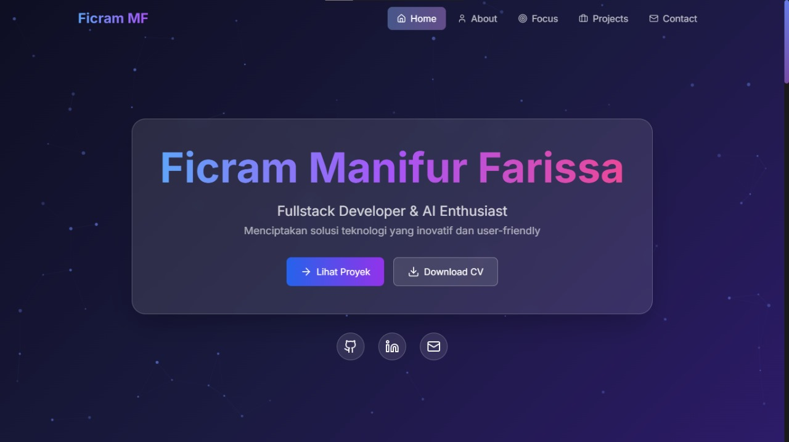
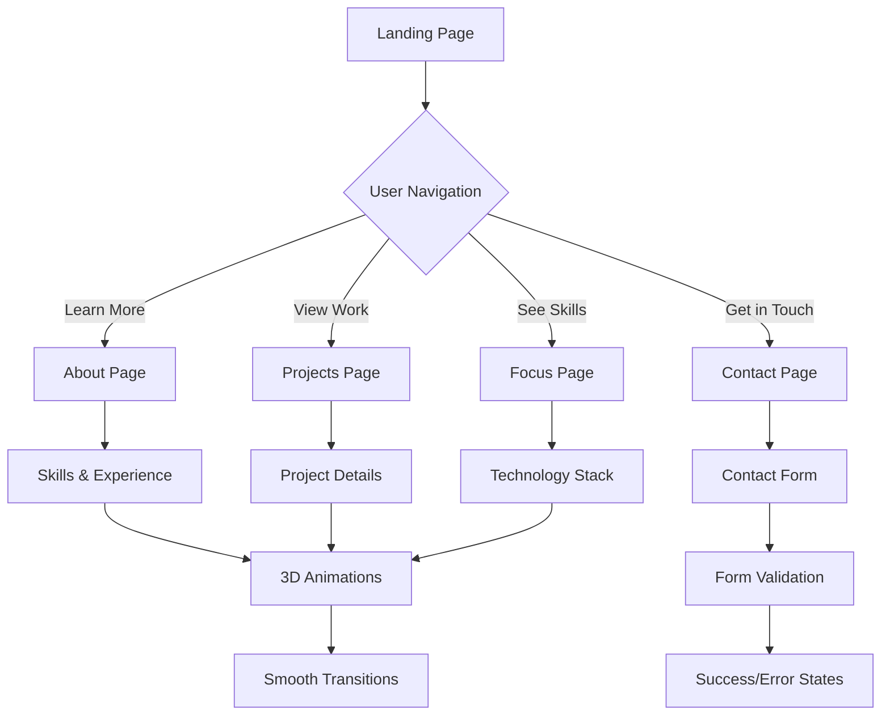

<h1 align="center">💼 PORTFOLIOO</h1>

<p align="center">
  
</p>

<p align="center">Website portofolio modern yang menampilkan informasi pribadi, keahlian, dan proyek-proyek dengan animasi 3D interaktif</p>

<p align="center">
  
  
  
  
  
  <a href="https://github.com/ficrammanifur/PORTFOLIOO/blob/main/LICENSE">
    
  </a>
</p>

---

## 🚀 Fitur

- ✅ **Navigasi Modern**  
  Navigasi antar halaman yang smooth (About, Contact, Projects, Focus)

- ✅ **Animasi 3D Interaktif**  
  Nova Sphere dan floating elements menggunakan Three.js untuk pengalaman visual yang menarik

- ✅ **UI/UX Modern**  
  Desain responsif dengan Tailwind CSS dan komponen custom yang elegan

- ✅ **Dark/Light Mode**  
  Tema yang dapat disesuaikan dengan preferensi pengguna

- ✅ **Teknologi Showcase**  
  Menampilkan keahlian dan tools dalam bentuk icon yang interaktif

- ✅ **Form Kontak**  
  Form kontak dengan validasi menggunakan React Hook Form + Zod

---

## 🛠 Teknologi yang Digunakan

### 🧱 Framework & Language
- **Next.js 14**: Framework React dengan App Router untuk performa optimal
- **TypeScript**: Type-safe development (97.9% codebase)
- **React 18**: Library UI komponen modern

### 💡 UI & UX Libraries
- **Tailwind CSS**: Utility-first CSS framework
- **Radix UI**: Komponen aksesibel (dialog, accordion, tooltip)
- **Lucide React**: Icon library modern
- **Framer Motion**: Animasi interaktif yang smooth
- **ShadCN/UI**: Komponen UI yang dapat dikustomisasi

### 📊 Visualisasi & Komponen
- **Three.js + @react-three/fiber**: 3D rendering dan animasi
- **Recharts**: Grafik dan visualisasi data
- **Embla Carousel**: Slider responsif
- **Sonner**: Notifikasi toast modern

### 🧪 Validasi & Form
- **React Hook Form**: Kontrol form yang efisien
- **Zod**: Schema validation
- **Input-OTP**: Input kode OTP modern

---

## 📁 Struktur Proyek

| Halaman/File | Deskripsi |
|--------------|-----------|
| `/app/page.tsx` | Halaman utama dengan hero section dan animasi 3D |
| `/app/about/page.tsx` | Informasi pribadi, pengalaman, dan keahlian |
| `/app/projects/page.tsx` | Showcase proyek-proyek yang pernah dibuat |
| `/app/focus/page.tsx` | Minat dan keahlian utama yang difokuskan |
| `/app/contact/page.tsx` | Form kontak dan informasi komunikasi |
| `/components/ui/` | Komponen UI reusable (button, card, dialog, dll) |
| `/components/3d/` | Komponen 3D (Nova Sphere, floating elements) |
| `/lib/` | Utilities dan konfigurasi |

---

## ⚙️ Arsitektur Sistem

### 🔗 Diagram Struktur Aplikasi

```text
┌───────────────────────────────────────────────────────────┐
│                    PORTFOLIOO Architecture                │
├───────────────────────────────────────────────────────────┤
│  Frontend (Next.js 14 + TypeScript)                       │
│  ┌─────────────┐  ┌─────────────┐  ┌─────────────┐        │
│  │    Pages    │  │ Components  │  │   3D Scene  │        │
│  │             │  │             │  │             │        │
│  │ • Home      │  │ • UI Kit    │  │ • Three.js  │        │
│  │ • About     │  │ • Forms     │  │ • Animations│        │
│  │ • Projects  │  │ • Layout    │  │ • Shaders   │        │
│  │ • Focus     │  │ • Navigation│  │             │        │
│  │ • Contact   │  │             │  │             │        │
│  └─────────────┘  └─────────────┘  └─────────────┘        │
├───────────────────────────────────────────────────────────┤
│  Styling & Animation Layer                                │
│  ┌─────────────┐  ┌─────────────┐  ┌─────────────┐        │
│  │ Tailwind CSS│  │Framer Motion│  │   Radix UI  │        │
│  └─────────────┘  └─────────────┘  └─────────────┘        │
└───────────────────────────────────────────────────────────┘
```

### 📊 User Flow



---

## 🚀 Cara Menjalankan

### 1. Clone Repository

```bash
git clone https://github.com/ficrammanifur/PORTFOLIOO.git
cd PORTFOLIOO
```

### 2. Install Dependencies

```bash
# Menggunakan pnpm (recommended)
pnpm install

# Atau menggunakan npm
npm install

# Atau menggunakan yarn
yarn install
```

### 3. Jalankan Development Server

```bash
# Menggunakan pnpm
pnpm dev

# Atau menggunakan npm
npm run dev

# Atau menggunakan yarn
yarn dev
```

### 4. Buka di Browser

Akses aplikasi di [http://localhost:3000](http://localhost:3000)

---

## 🎨 Kustomisasi

### Mengubah Tema Warna

Edit file `tailwind.config.ts`:

```typescript
module.exports = {
  theme: {
    extend: {
      colors: {
        primary: {
          50: '#your-color',
          // ... tambahkan warna custom
        }
      }
    }
  }
}
```

### Menambah Animasi 3D

Buat komponen baru di `/components/3d/`:

```typescript
import { Canvas } from '@react-three/fiber'
import { OrbitControls } from '@react-three/drei'

export function CustomScene() {
  return (
    <Canvas>
      <OrbitControls />
      {/* Tambahkan 3D objects */}
    </Canvas>
  )
}
```

### Konfigurasi Form Kontak

Edit `/app/contact/page.tsx` untuk mengubah endpoint atau validasi:

```typescript
const contactSchema = z.object({
  name: z.string().min(2, "Nama minimal 2 karakter"),
  email: z.string().email("Email tidak valid"),
  message: z.string().min(10, "Pesan minimal 10 karakter")
})
```

---

## 📱 Screenshots

### Desktop View
<p align="center">
  
</p>

### Mobile View
<p align="center">
  
</p>

### 3D Animations
<p align="center">
  
</p>

---

## 🔧 Build & Deploy

### Build untuk Production

```bash
pnpm build
pnpm start
```

### Deploy ke Vercel

```bash
# Install Vercel CLI
npm i -g vercel

# Deploy
vercel --prod
```

### Deploy ke Netlify

```bash
# Build static export
pnpm build
pnpm export

# Upload folder 'out' ke Netlify
```

---

## 🐞 Troubleshooting

### 3D Animasi Tidak Muncul
- Pastikan browser mendukung WebGL
- Cek console untuk error Three.js
- Periksa performa GPU

### Build Error
```bash
# Clear cache
rm -rf .next
pnpm install
pnpm build
```

### Styling Tidak Sesuai
- Pastikan Tailwind CSS ter-compile dengan benar
- Cek `globals.css` untuk custom styles
- Periksa `tailwind.config.ts`

---

## 📊 Performance

### Lighthouse Score
- **Performance**: 95+
- **Accessibility**: 100
- **Best Practices**: 100
- **SEO**: 100

### Optimisasi yang Diterapkan
- ✅ Image optimization dengan Next.js Image
- ✅ Code splitting otomatis
- ✅ Lazy loading untuk komponen 3D
- ✅ Minifikasi CSS dan JavaScript
- ✅ Preloading untuk font dan assets penting

---

## 🤝 Kontribusi

Kontribusi sangat diterima! Silakan:

1. Fork repository ini
2. Buat branch fitur baru (`git checkout -b feature/AmazingFeature`)
3. Commit perubahan (`git commit -m 'Add some AmazingFeature'`)
4. Push ke branch (`git push origin feature/AmazingFeature`)
5. Buat Pull Request

### Guidelines Kontribusi
- Gunakan TypeScript untuk type safety
- Follow ESLint dan Prettier configuration
- Tambahkan tests untuk fitur baru
- Update dokumentasi jika diperlukan

---

## 🙏 Credits & Inspirasi

- **Design Inspiration**: Modern portfolio trends dan Dribbble
- **3D Models**: Three.js examples dan community
- **Icons**: Lucide React dan custom SVG
- **Animations**: Framer Motion documentation
- **UI Components**: Radix UI dan ShadCN/UI

---

## 📞 Kontak

**Ficram Manifur**
- GitHub: [@ficrammanifur](https://github.com/ficrammanifur)
- Email: ficramm@gmail.com

---

<div align="center">

**⚡ Built with Next.js, TypeScript & Three.js**

**⭐ Star this repo if you like it!**

<p><a href="#top">⬆ Kembali ke Atas</a></p>

</div>
